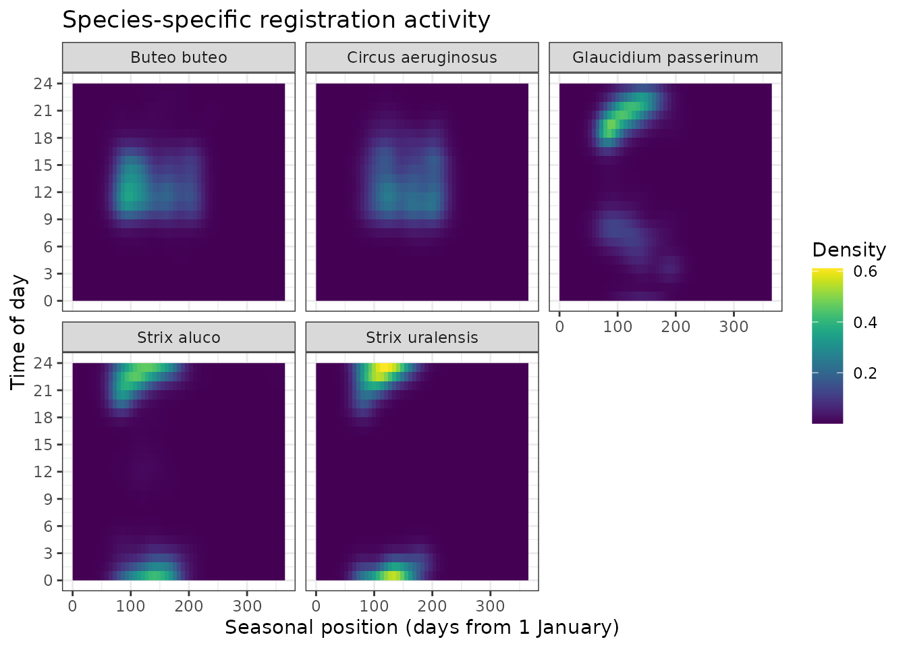
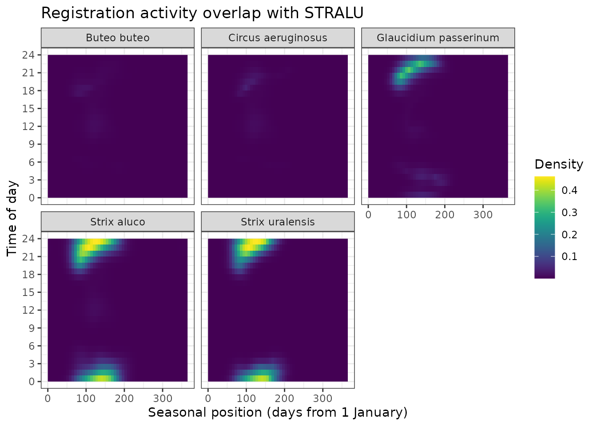

# Introduction to sdmhelpers

``` r

library(sdmhelpers)
library(sf)
#> Linking to GEOS 3.12.1, GDAL 3.8.4, PROJ 9.4.0; sf_use_s2() is TRUE
library(ggplot2)
```

## Overview

`sdmhelpers` provides helper functions for species distribution
modelling (SDM) workflows, with particular emphasis on
presence-background models implemented with `maxnet`. The package
contains tools for constructing sampling-bias surfaces from target-group
records, weighting target-group observations by seasonal or combined
seasonal and diel overlap, selecting complete spatial folds for
independent testing, screening environmental predictors, and evaluating
predictions using the true skill statistic (TSS).

Presence-only SDMs are sensitive to differences between the sampling
process that generated species observations and the process used to
select background locations. A commonly used approach is therefore to
select or weight background data so that they reflect similar sampling
bias to the presence data ([Phillips et al. 2009](#ref-phillips2009);
[Elith et al. 2011](#ref-elith2011)). `sdmhelpers` extends this idea by
allowing records from a target group to contribute unequally according
to their temporal similarity to the focal species.

The examples below use datasets distributed with `sdmhelpers`. They are
reduced or pseudonymised datasets intended for demonstrating package
functionality, not for biological inference.

`sdmhelpers` was developed as part of the project *HiQBioDiv:
High-resolution quantification of biodiversity for conservation and
management*, funded by the Latvian Council of Science (Ref.
No. VPP-VARAM-DABA-2024/1-0002).

The development version can be installed from GitHub with:

``` r

# install.packages("remotes")
remotes::install_github("aavotins/sdmhelpers")
```

## Example data

Several example datasets are included in the package. The examples in
this vignette use bird, amphibian and bryophyte observations, spatial
presence and background locations, spatial blocks, a 100-m grid, known
habitat-inventory dates, and an example environmental raster.

``` r

data("aves_small", package = "sdmhelpers")
data("bryophyta_one", package = "sdmhelpers")
data("habitat_inventories", package = "sdmhelpers")
data("points100", package = "sdmhelpers")
data("example_grid", package = "sdmhelpers")
example_grid=terra::unwrap(example_grid)
data("example_presences", package = "sdmhelpers")
data("example_background", package = "sdmhelpers")
data("example_independent_blocks", package = "sdmhelpers")
data("egv_names", package = "sdmhelpers")
```

The environmental raster used later in the vignette is stored in
`inst/extdata`.

``` r

egv_file <- system.file("extdata",
                        "example_egv.tif",
                        package = "sdmhelpers")

egv_file
#> [1] "/home/runner/work/_temp/Library/sdmhelpers/extdata/example_egv.tif"
```

## Simple target-group bias surface

Target-group background sampling uses observations of taxa that are
expected to have been collected through a sampling process similar to
that of the focal species. If sampling effort is spatially biased,
drawing background data from the same biased sampling domain can reduce
the contrast between presence and background sampling processes
([Phillips et al. 2009](#ref-phillips2009)).

Here, one species from `aves_small` is treated as the focal species and
all remaining species form the target group. The focal species is chosen
programmatically as the species with the largest number of records so
that the example does not depend on a particular species name.

``` r

target_species <- names(
  sort(table(aves_small$species), decreasing = TRUE)
)[1]

target_species
#> [1] "Strix aluco"

target_group <- aves_small
```

Multiple observations can occur in the same 100-m grid cell. For the
spatial bias surface, records are therefore counted by grid cell and
supplied to
[`kde_surface()`](https://aavotins.github.io/sdmhelpers/reference/kde_surface.md)
as weights.

``` r

tg_counts <- aggregate(
  list(n_records = rep(1, nrow(target_group))),
  by = list(id100 = target_group$id100),
  FUN = sum
)

idx <- match(tg_counts$id100, points100$id)
keep <- !is.na(idx)

tg_points <- points100[idx[keep], ]
tg_points$n_records <- tg_counts$n_records[keep]

tg_points
#> Simple feature collection with 1065 features and 7 fields
#> Geometry type: POINT
#> Dimension:     XY
#> Bounding box:  xmin: 459750 ymin: 285250 xmax: 519650 ymax: 329550
#> Projected CRS: LKS-92 / Latvia TM
#> First 10 features:
#>                     id yes tks50km rinda300       ID1km rinda500
#> 1714235 100mX4597Y3042   1    4221   385184 1kmX459Y304   236094
#> 1714987 100mX4598Y3044   1    4221   386590 1kmX459Y304   236995
#> 1719476 100mX4604Y3043   1    4221   386592 1kmX460Y304   236096
#> 1719478 100mX4604Y3045   1    4221   386592 1kmX460Y304   236996
#> 1723202 100mX4609Y3038   1    4221   383781 1kmX460Y303   235197
#> 1723204 100mX4609Y3040   1    4221   385188 1kmX460Y304   236097
#> 1723921 100mX4610Y3013   1    4221   372533 1kmX461Y301   230697
#> 1723922 100mX4610Y3014   1    4221   372533 1kmX461Y301   231597
#> 1723926 100mX4610Y3018   1    4221   373936 1kmX461Y301   231597
#> 1723950 100mX4610Y3042   1    4221   385189 1kmX461Y304   236097
#>                          geom n_records
#> 1714235 POINT (459750 304250)         1
#> 1714987 POINT (459850 304450)         1
#> 1719476 POINT (460450 304350)         1
#> 1719478 POINT (460450 304550)         1
#> 1723202 POINT (460950 303850)         1
#> 1723204 POINT (460950 304050)         2
#> 1723921 POINT (461050 301350)         1
#> 1723922 POINT (461050 301450)         3
#> 1723926 POINT (461050 301850)         2
#> 1723950 POINT (461050 304250)         1
```

[`kde_surface()`](https://aavotins.github.io/sdmhelpers/reference/kde_surface.md)
first bins point weights to the reference raster and then applies
Gaussian smoothing. This makes the calculation practical for large
rasters and large bandwidths. Kernel density estimation in general is
described by Silverman ([1986](#ref-silverman1986)).

The example grid uses EPSG:3059, whose map units are metres, so
`sigma = 3000` corresponds to a Gaussian bandwidth of 3 km. With
`normalize = "pdf"`, the resulting surface is normalized to integrate to
one and represents the spatial probability density of target-group
sampling effort. It can therefore be used as a relative sampling-bias
surface for background sampling.

``` r

simple_bias <- kde_surface(
  x = tg_points,
  weight_field = "n_records",
  sigma = 3000,
  ref = example_grid,
  normalize = "pdf",
  mask = TRUE
)

terra::plot(simple_bias, main = "Simple target-group bias")
```


Unweighted target-group sampling-bias surface.

This simple approach assumes that every target-group record is equally
informative about the sampling process affecting the focal species. The
next sections relax that assumption.

## Phenologically weighted target group

Species observed by the same people or recording scheme may nevertheless
have different seasonal detectability. A species recorded mainly in
winter, for example, may provide little information about sampling
effort relevant to a species recorded mainly during late spring.

[`phenology_overlap_weights()`](https://aavotins.github.io/sdmhelpers/reference/phenology_overlap_weights.md)
estimates the overlap between the day-of-year distribution of a focal
species and each comparison species using kernel-density overlap. The
overlap coefficient describes the common area of two estimated
distributions ([Pastore 2018](#ref-pastore2018); [Pastore and Calcagnì
2019](#ref-pastore2019)).

First, day of year is added to the bird records.

``` r

bird_dates <- aves_small
bird_dates$DoY <- as.POSIXlt(bird_dates$date)$yday + 1L

target_code <- bird_dates$code[
  match(target_species, bird_dates$species)
]

target_code
#> [1] "STRALU"
```

We then estimate phenological overlap between the focal species and
every species in the remaining target group.

``` r

phenology_weights <- phenology_overlap_weights(
  target = bird_dates,
  group = bird_dates[bird_dates$species != target_species, ],
  target_code = target_code,
  target_id = "code",
  group_id = "code",
  target_doy = "DoY",
  group_doy = "DoY",
  type = "2",
  min_n = 5
)

phenology_weights[
  order(phenology_weights$weight, decreasing = TRUE),
]
#>          code   overlap    weight
#> GLAPAS GLAPAS 0.8256341 0.2990645
#> STRURA STRURA 0.8053464 0.2917158
#> BUTBUT BUTBUT 0.6383454 0.2312240
#> CIRAER CIRAER 0.4913965 0.1779956
```

The returned `weight` values sum to one across comparison species with
valid overlap estimates. Here, each target-group observation receives
the weight of its species. Records are then summed within 100-m cells
before KDE smoothing.

``` r

target_group_p <- merge(
  target_group,
  phenology_weights[, c("code", "weight")],
  by = "code",
  all.x = TRUE
)

target_group_p <- target_group_p[
  is.finite(target_group_p$weight) &
    !is.na(target_group_p$id100),
]

tg_weighted <- aggregate(
  list(weight = target_group_p$weight),
  by = list(id100 = target_group_p$id100),
  FUN = sum
)

idx <- match(tg_weighted$id100, points100$id)
keep <- !is.na(idx)

tg_points_weighted <- points100[idx[keep], ]
tg_points_weighted$weight <- tg_weighted$weight[keep]
```

``` r

phenology_bias <- kde_surface(
  x = tg_points_weighted,
  weight_field = "weight",
  sigma = 3000,
  ref = example_grid,
  normalize = "meanG",
  mask = TRUE
)

terra::plot(
  phenology_bias,
  main = "Phenologically weighted target-group bias"
)
```


Phenologically weighted target-group sampling-bias surface.

The weighted surface should be interpreted as a relative sampling-bias
surface, not as an estimate of species occurrence probability. Its
purpose is to describe where observations relevant to the focal species’
seasonal sampling process were more or less likely to have been
collected.

## Seasonally and dielly weighted target group

For taxa whose detectability varies both seasonally and through the day,
seasonal overlap alone may be insufficient.
[`torus_overlap_many()`](https://aavotins.github.io/sdmhelpers/reference/torus_overlap_many.md)
represents season and time of day as two circular dimensions and
estimates overlap on a two-dimensional torus. Circular treatment is
important because both annual and daily cycles wrap around their
endpoints; see Mardia and Jupp ([2000](#ref-mardia2000)) for directional
statistics and Ridout and Linkie ([2009](#ref-ridout2009)) for overlap
estimation of diel activity patterns.

The bird dataset contains date-time observations. Because this is an
introductory vignette, the example uses the focal species with the
largest number of valid date-times and compares it with the 20 most
frequently recorded remaining species.

``` r


target_species_torus <- target_species

reference_data <- aves_small[aves_small$species == target_species_torus & 
                               !is.na(aves_small$date_time),]

comparison_data <- aves_small[!is.na(aves_small$date_time),]

reference_data$obs_date <- as.Date(reference_data$date_time)
reference_data$obs_time <- hms::as_hms(reference_data$date_time)

comparison_data$obs_date <- as.Date(comparison_data$date_time)
comparison_data$obs_time <- hms::as_hms(comparison_data$date_time)
```

For speed, the example uses a coarser evaluation grid than would often
be used in a final analysis.

``` r

torus_result <- torus_overlap_many(
  reference_data = reference_data,
  comparison_data = comparison_data,
  comparison_group_col = "species",
  reference_date_col = "obs_date",
  reference_time_col = "obs_time",
  comparison_date_col = "obs_date",
  comparison_time_col = "obs_time",
  reference_name = target_species_torus,
  season_bw_days = 14,
  daily_bw_hours = 1,
  date_resolution_days = 7,
  time_resolution_minutes = 60,
  min_n = 5,
  return_density = FALSE
)

torus_overlap <- torus_result$overlap
torus_overlap <- torus_overlap[
  order(torus_overlap$overlap, decreasing = TRUE),
]

head(torus_overlap, 10)
#>     reference            comparison n_reference n_comparison    overlap status
#> 4 Strix aluco           Strix aluco        3004         3004 1.00000000     OK
#> 5 Strix aluco       Strix uralensis        3004          137 0.86931899     OK
#> 3 Strix aluco Glaucidium passerinum        3004          330 0.41910228     OK
#> 2 Strix aluco    Circus aeruginosus        3004          671 0.04184691     OK
#> 1 Strix aluco           Buteo buteo        3004         2095 0.03477199     OK
```

The overlap coefficient ranges from zero to one for normalized
densities. A large value indicates that a comparison species has a
seasonal-diel observation distribution similar to the focal species.

To use these coefficients as relative species weights in a target group,
they can be normalized across comparison species.

``` r

ok <- is.finite(torus_overlap$overlap)

torus_overlap$weight <- NA_real_
torus_overlap$weight[ok] <-
  torus_overlap$overlap[ok] /
  sum(torus_overlap$overlap[ok])

head(
  torus_overlap[
    order(torus_overlap$weight, decreasing = TRUE),
    c("comparison", "overlap", "weight")
  ],
  10
)
#>              comparison    overlap     weight
#> 4           Strix aluco 1.00000000 0.42282580
#> 5       Strix uralensis 0.86931899 0.36757050
#> 3 Glaucidium passerinum 0.41910228 0.17720726
#> 2    Circus aeruginosus 0.04184691 0.01769395
#> 1           Buteo buteo 0.03477199 0.01470250
```

These weights can be joined back to the individual observations and
passed to
[`kde_surface()`](https://aavotins.github.io/sdmhelpers/reference/kde_surface.md)
in exactly the same way as the phenological weights above.

The overlap can also be visualised, when setting `return_density = TRUE`

``` r

torus_result <- torus_overlap_many(
  reference_data = reference_data,
  comparison_data = comparison_data,
  comparison_group_col = "species",
  reference_date_col = "obs_date",
  reference_time_col = "obs_time",
  comparison_date_col = "obs_date",
  comparison_time_col = "obs_time",
  reference_name = target_species_torus,
  season_bw_days = 14,
  daily_bw_hours = 1,
  date_resolution_days = 7,
  time_resolution_minutes = 60,
  min_n = 5,
  return_density = TRUE
)

ggplot(torus_result$density,aes(x = seasonal_position_days,
                          y = decimal_hour,
                          fill = comparison_density)) +
  geom_raster() +
  facet_wrap(~ comparison) +
  scale_y_continuous(breaks = seq(0, 24, by = 3)) +
  viridis::scale_fill_viridis() +
  labs(x = "Seasonal position (days from 1 January)",
       y = "Time of day",
       fill = "Density",
       title = "Species-specific registration activity") +
  theme_bw()
```



``` r


ggplot(torus_result$density,aes(x = seasonal_position_days,
                          y = decimal_hour,
                          fill = shared_density)) +
  geom_raster() +
  facet_wrap(~ comparison) +
  scale_y_continuous(breaks = seq(0, 24, by = 3)) +
  viridis::scale_fill_viridis() +
  labs(x = "Seasonal position (days from 1 January)",
       y = "Time of day",
       fill = "Density",
       title = "Registration activity overlap with STRALU") +
  theme_bw()
```



## Known inventory dates

Sometimes the dates of a survey or habitat inventory are known, while
the species itself was not necessarily recorded during that survey. In
this case,
[`doy_kde_weights()`](https://aavotins.github.io/sdmhelpers/reference/doy_kde_weights.md)
can estimate how closely each inventory date corresponds to the seasonal
activity distribution of a target species.

The function estimates a wrapped day-of-year KDE from reference dates
and evaluates that density at another set of dates. The wrapped
construction reduces the artificial separation between observations near
the end and beginning of a year. Bandwidth controls the degree of
smoothing, as in conventional KDE ([Silverman
1986](#ref-silverman1986)).

The example below uses one bryophyte species, which is considered
old-growth forest specialist species, thus specifically searched during
habitat inventories, as the reference seasonal distribution and weights
the dates in `habitat_inventories`.

``` r

bryophyta_species <- names(
  sort(table(bryophyta_one$species), decreasing = TRUE)
)[1]

reference_dates <- bryophyta_one$date[
  bryophyta_one$species == bryophyta_species &
    !is.na(bryophyta_one$date)
]

inventory_keep <- !is.na(habitat_inventories$date)

inventory_weights <- doy_kde_weights(
  A_dates = reference_dates,
  B_dates = habitat_inventories$date[inventory_keep],
  scale = "percentile_A",
  bw = "nrd0"
)

weighted_inventories <- habitat_inventories[inventory_keep, ]
weighted_inventories$phenology_weight <- inventory_weights$weights
```

With `scale = "percentile_A"`, weights describe how high the estimated
reference density is relative to density values across the seasonal
cycle. They are relative phenological correspondence scores rather than
occurrence probabilities.

``` r

aggregate(
  phenology_weight ~ habitat_type,
  data = weighted_inventories,
  FUN = mean
)
#>   habitat_type phenology_weight
#> 1         dune        0.7492080
#> 2       forest        0.7281414
#> 3   freshwater        0.6848989
#> 4    grassland        0.6864115
#> 5      heather        0.0630137
#> 6         mire        0.6161949
```

The estimated seasonal reference curve can also be inspected directly.

``` r

plot(
  inventory_weights$density$x,
  inventory_weights$density$y,
  type = "l",
  xlab = "Day of year",
  ylab = "Estimated reference density"
)
```


Estimated seasonal activity curve used for weighting known inventory
dates.

## Selecting an independent testing set

Random train-test splitting can give overly optimistic estimates of
predictive performance when nearby observations are spatially dependent.
Spatially structured resampling is therefore generally preferable when
the intended prediction involves geographic transfer ([Roberts et al.
2017](#ref-roberts2017)).

`sdmhelpers` does not define the spatial blocks themselves. Instead,
[`select_folds_by_quota()`](https://aavotins.github.io/sdmhelpers/reference/select_folds_by_quota.md)
and
[`select_joint_folds()`](https://aavotins.github.io/sdmhelpers/reference/select_joint_folds.md)
select complete groups from fold identifiers created elsewhere.
Independence therefore comes from the design of the folds, not from the
selection function.

The package contains example presence records, background records, and
independent spatial polygons.

``` r

pres_sf <- sf::st_as_sf(
  example_presences,
  coords = c("x", "y"),
  crs = 3059
)

bg_sf <- sf::st_as_sf(
  example_background,
  coords = c("x", "y"),
  crs = 3059
)

block_id <- setdiff(
  names(example_independent_blocks),
  attr(example_independent_blocks, "sf_column")
)[1]

pres_joined <- sf::st_join(
  pres_sf,
  example_independent_blocks[block_id],
  join = sf::st_within,
  left = TRUE
)

bg_joined <- sf::st_join(
  bg_sf,
  example_independent_blocks[block_id],
  join = sf::st_within,
  left = TRUE
)

pres_folds <- pres_joined[[block_id]]
bg_folds <- bg_joined[[block_id]]
```

When both presences and background should be withheld from the same
spatial blocks,
[`select_joint_folds()`](https://aavotins.github.io/sdmhelpers/reference/select_joint_folds.md)
is convenient.

``` r

independent <- select_joint_folds(
  pres_folds = pres_folds,
  bg_folds = bg_folds,
  target_prop = 0.25,
  pres_bounds = c(0.20, 0.30),
  bg_bounds = c(0.20, 0.30),
  max_tries = 3000,
  bg_match_weight = 1,
  seed = 1,
  print_report = FALSE
)

independent$selected_fold_ids
#>   [1] "110" "117" "142" "153" "183" "186" "197" "208" "252" "280" "282" "291"
#>  [13] "312" "323" "325" "340" "343" "353" "354" "380" "392" "397" "398" "4"  
#>  [25] "406" "407" "411" "413" "421" "433" "434" "44"  "441" "459" "464" "475"
#>  [37] "479" "490" "506" "511" "515" "516" "518" "519" "521" "523" "536" "537"
#>  [49] "539" "543" "548" "553" "572" "590" "600" "606" "610" "613" "629" "631"
#>  [61] "641" "643" "644" "645" "646" "647" "661" "670" "671" "675" "677" "68" 
#>  [73] "686" "697" "70"  "703" "712" "715" "717" "722" "732" "734" "738" "749"
#>  [85] "83"  "95"  "100" "101" "103" "104" "11"  "116" "12"  "124" "125" "126"
#>  [97] "130" "144" "145" "147" "149" "152" "155" "18"  "180" "192" "194" "198"
#> [109] "2"   "201" "203" "211" "220" "228" "232" "237" "238" "242" "247" "255"
#> [121] "26"  "262" "28"  "287" "288" "289" "29"  "292" "295" "3"   "30"  "326"
#> [133] "328" "330" "341" "347" "350" "352" "36"  "363" "369" "375" "379" "388"
#> [145] "394" "402" "408" "42"  "436" "438" "447" "453" "456" "457" "462" "463"
#> [157] "466" "482" "494" "495" "500" "525" "534" "540" "560" "564" "568" "571"
#> [169] "575" "58"  "593" "596" "597" "598" "599" "60"  "612" "617" "618" "634"
#> [181] "636" "64"  "640" "649" "658" "66"  "662" "664" "665" "666" "667" "676"
#> [193] "684" "693" "694" "696" "7"   "721" "741" "75"  "78"  "8"   "9"   "91" 
#> [205] "93"  "98"
independent$summary[c(
  "n_pres_selected",
  "n_bg_selected",
  "prop_pres_selected",
  "prop_bg_selected"
)]
#> $n_pres_selected
#> 295 
#> 694 
#> 
#> $n_bg_selected
#>  295 
#> 9957 
#> 
#> $prop_pres_selected
#>     295 
#> 0.24991 
#> 
#> $prop_bg_selected
#>       295 
#> 0.2499122
```

The returned logical vectors preserve the row order of the input data
and can be used directly for subsetting.

``` r

pres_test <- example_presences[independent$pres_selected_idx, ]
pres_train <- example_presences[!independent$pres_selected_idx, ]

bg_test <- example_background[independent$bg_selected_idx, ]
bg_train <- example_background[!independent$bg_selected_idx, ]

c(
  pres_train = nrow(pres_train),
  pres_test = nrow(pres_test),
  bg_train = nrow(bg_train),
  bg_test = nrow(bg_test)
)
#> pres_train  pres_test   bg_train    bg_test 
#>       2084        694      30043       9957
```

If only one type of observation needs to be selected, the simpler
[`select_folds_by_quota()`](https://aavotins.github.io/sdmhelpers/reference/select_folds_by_quota.md)
can be used instead.

``` r

presence_only_selection <- select_folds_by_quota(
  folds = pres_folds,
  target_prop = 0.25,
  bounds = c(0.20, 0.30),
  seed = 1,
  print_report = FALSE
)

presence_only_selection$summary$prop_selected
#> [1] 0.299964
```

## Screening predictor variance

Predictors with zero or extremely small variance in the data available
for model fitting can create numerical problems and cannot meaningfully
contribute to estimating an environmental response.
[`screen_egv_variance()`](https://aavotins.github.io/sdmhelpers/reference/screen_egv_variance.md)
checks predictor variance across several SDM-relevant subsets rather
than only across the complete dataset.

The example environmental raster contains five ecogeographical
variables.

``` r

env <- terra::rast(egv_file)
env
#> class       : SpatRaster
#> size        : 650, 650, 5  (nrow, ncol, nlyr)
#> resolution  : 100, 100  (x, y)
#> extent      : 455000, 520000, 280000, 345000  (xmin, xmax, ymin, ymax)
#> coord. ref. : LKS-92 / Latvia TM (EPSG:3059)
#> source      : example_egv.tif
#> names       :   egv_280,   egv_293,   egv_302,   egv_385,   egv_400
#> min values  : -0.466794, -0.719917, -0.397964, -1.461203,  -0.37327
#> max values  :   3.70894,  7.054723,  8.359298,  5.206886, 11.300995
```

For a compact vignette example, a subset of the training background is
used to construct an
[`SDMtune::SWD`](https://consbiol-unibern.github.io/SDMtune/reference/SWD-class.html)
object.

``` r

set.seed(42)

bg_screen <- bg_train[sample.int(nrow(bg_train), 5000), ]

train_swd <- SDMtune::prepareSWD(
  species = "example_species",
  p = pres_train,
  a = bg_screen,
  env = env
)
#> ℹ Extracting predictor information for presence locations
#> Warning: ! 2009 locations are NA for some environmental variables and have been
#>   discarded
#> ✔ Extracting predictor information for presence locations [43ms]
#> 
#> ℹ Extracting predictor information for absence/background locations
#> Warning: ! 4776 locations are NA for some environmental variables and have been
#>   discarded
#> ✔ Extracting predictor information for absence/background locations [170ms]
#> 
```

The environmental-domain check is added by supplying `env`.

``` r

variance_screen <- screen_egv_variance(
  train = train_swd,
  env = env,
  env_sample_n = 5000,
  seed = 1,
  sd_tol = 0,
  verbose = FALSE
)

variance_screen$keep
#> [1] "egv_280" "egv_293" "egv_302" "egv_385" "egv_400"
variance_screen$remove
#> character(0)
```

A predictor is retained only if it passes every requested check. The
`diagnostics` component provides the standard deviation and failure
reason for every evaluated predictor/subset combination.

``` r

head(variance_screen$diagnostics)
#>      check    subset variable n_finite        sd failed reason
#> 1 training       all  egv_280      299 1.7877959  FALSE passed
#> 2 training       all  egv_293      299 2.1531393  FALSE passed
#> 3 training       all  egv_302      299 1.5895812  FALSE passed
#> 4 training       all  egv_385      299 0.5944876  FALSE passed
#> 5 training       all  egv_400      299 0.8052472  FALSE passed
#> 6 training presences  egv_280       75 1.5562103  FALSE passed
```

## Fitting a small maxnet model

The package is designed to support, rather than replace, SDM software.
The following compact example fits a `maxnet` model after the
independent split created above. Only predictors retained by the
variance screen are used.

First extract environmental values for the training and
independent-testing locations.

``` r

training_set <- SDMtune::prepareSWD(
  species = "example_species",
  p = pres_train,
  a = bg_train,
  env = env
)
#> ℹ Extracting predictor information for presence locations
#> Warning: ! 2009 locations are NA for some environmental variables and have been
#>   discarded
#> ✔ Extracting predictor information for presence locations [27ms]
#> 
#> ℹ Extracting predictor information for absence/background locations
#> Warning: ! 28679 locations are NA for some environmental variables and have been
#>   discarded
#> ✔ Extracting predictor information for absence/background locations [65ms]
#> 
training_set=SDMtune::addSamplesToBg(training_set)

testing_set <- SDMtune::prepareSWD(
  species = "example_species",
  p = pres_test,
  a = bg_test,
  env = env
)
#> ℹ Extracting predictor information for presence locations
#> Warning: ! 613 locations are NA for some environmental
#> variables and have been discarded
#> ✔ Extracting predictor information for presence locations [25ms]
#> ℹ Extracting predictor information for absence/background locations
#> Warning: ! 8890 locations are NA for some environmental variables and have been
#>   discarded
#> ✔ Extracting predictor information for absence/background locations [48ms]
#> 
testing_set=SDMtune::addSamplesToBg(testing_set)
```

Fit the model using presences (`1`) and background (`0`).

``` r

maxnet_model <- maxnet::maxnet(
  p = training_set@pa,
  data = training_set@data
)
```

## Evaluating models with TSS

The true skill statistic is

\\ \mathrm{TSS} = \mathrm{sensitivity} + \mathrm{specificity} - 1, \\

and was proposed for SDM evaluation as an alternative to measures such
as Cohen’s kappa ([Allouche et al. 2006](#ref-allouche2006)).

[`max_tss()`](https://aavotins.github.io/sdmhelpers/reference/max_tss.md)
evaluates all unique finite prediction thresholds and returns the
threshold that maximizes TSS together with sensitivity and specificity.

For presence-background models, background locations are not confirmed
absences. Consequently, the value reported as specificity is
operationally the proportion of background records classified as
negative, and the resulting TSS should be interpreted as
presence-background discrimination rather than classification accuracy
against known true absences.

``` r

p_pos <- predict(
  maxnet_model,
  newdata = testing_set@data[testing_set@pa == 1, ],
  type = "cloglog"
)

p_neg <- predict(
  maxnet_model,
  newdata = testing_set@data[testing_set@pa == 0, ],
  type = "cloglog"
)

tss_result <- max_tss(
  p_pos = p_pos,
  p_neg = p_neg
)

tss_result
#>         tss   threshold sensitivity specificity 
#>   0.5388469   0.2693770   0.8765432   0.6623037
```

The selected threshold can then be used to convert continuous
predictions into binary classifications if a binary map or confusion
matrix is required.

``` r

threshold <- unname(tss_result["threshold"])

presence_class <- p_pos >= threshold
background_class <- p_neg >= threshold

c(
  sensitivity = mean(presence_class),
  background_specificity = mean(!background_class)
)
#>            sensitivity background_specificity 
#>              0.8765432              0.6623037
```

## Cross-validation TSS with ENMeval

The independent testing set created above is reserved for evaluating the
final model and should not be used during model tuning. Alternative
model settings can instead be compared by cross-validation using only
the training data. Spatially structured cross-validation is particularly
useful when observations are spatially autocorrelated because it reduces
spatial dependence between calibration and validation data and provides
a more stringent assessment of spatial transferability than random
partitioning ([Roberts et al. 2017](#ref-roberts2017)).

ENMeval provides several approaches for partitioning occurrence and
background records and for evaluating alternative Maxent and `maxnet`
model settings ([Muscarella et al. 2014](#ref-muscarella2014); [Kass et
al. 2021](#ref-kass2021)). In this example, the training records are
divided into four geographically structured groups using
[`ENMeval::get.block()`](https://jamiemkass.github.io/ENMeval/reference/partitions.html).

``` r

block_folds <- ENMeval::get.block(occ = training_set@coords[training_set@pa == 1, ], 
                                  bg = training_set@coords[training_set@pa == 0, ])
```

The block method divides occurrence localities into four spatial groups
and assigns background records to the corresponding geographic
partitions. Because the example coordinates are in the projected LKS-92
/ Latvia TM coordinate reference system, the partitions are defined
using projected X and Y coordinates rather than geographic longitude and
latitude.

The resulting fold identifiers are supplied to `ENMevaluate()` as
user-defined partitions. This makes it possible to use the same spatial
groups for both presence and background observations while retaining
explicit control over the cross-validation design.

For this example, three feature-class combinations and three
regularization multipliers are evaluated, producing nine candidate model
settings. Linear (`L`), quadratic (`Q`), and combined linear-quadratic
(`LQ`) feature classes control the shapes of fitted environmental
responses, whereas the regularization multiplier controls the strength
of penalization and therefore model complexity.

``` r

presences=cbind(training_set@coords[training_set@pa == 1, ],
                 training_set@data[training_set@pa == 1, ])
background=cbind(training_set@coords[training_set@pa == 0, ],
           training_set@data[training_set@pa == 0, ])
pirmais <- ENMeval::ENMevaluate(occs = presences, 
                       bg = background,
                       algorithm = 'maxnet', 
                       partitions = 'user', 
                       user.grp=list(occs.grp=block_folds$occs.grp,
                                     bg.grp=block_folds$bg.grp),
                       tune.args = list(fc = c('L','Q','LQ'), 
                                        rm = c(0.5,1,2)),
                       other.settings=list(validation.bg='partition'),
                       user.eval = tss_user_eval)
#> Package ecospat is not installed, so Continuous Boyce Index (CBI) cannot be calculated.
#> *** Running initial checks... ***
#> * Please make sure that the user-specified partitions are spatial, else validation.bg should be set to "full". The "partition" option only makes sense when partitions represent different regions of the study extent. See ?ENMevaluate for details.
#> * Variable values were input along with coordinates and not as raster data, so no raster predictions can be generated and AICc is calculated with background data for Maxent models.
#> * Model evaluations with user-defined 4-fold cross validation...
#> 
#> *** Running ENMeval v2.0.6 with maxnet from maxnet package v0.1.4 ***
#>   |                                                                              |                                                                      |   0%  |                                                                              |========                                                              |  11%  |                                                                              |================                                                      |  22%  |                                                                              |=======================                                               |  33%  |                                                                              |===============================                                       |  44%  |                                                                              |=======================================                               |  56%  |                                                                              |===============================================                       |  67%  |                                                                              |======================================================                |  78%  |                                                                              |==============================================================        |  89%  |                                                                              |======================================================================| 100%
#> ENMevaluate completed in 0 minutes 9 seconds.
```

The argument `user.eval = tss_user_eval` adds TSS as a custom evaluation
metric. For every cross-validation fold, `ENMeval` supplies predictions
for training occurrences, validation occurrences, training background
records and validation background records to
[`tss_user_eval()`](https://aavotins.github.io/sdmhelpers/reference/tss_user_eval.md),
which then applies
[`max_tss()`](https://aavotins.github.io/sdmhelpers/reference/max_tss.md)
to these validation predictions and returns the maximum TSS and its
associated classification threshold.

When

``` r


other.settings = list(validation.bg = "partition")
```

is used, validation occurrences are compared only with background
records from the corresponding validation partition. This means that
both presences and background records are spatially withheld during
evaluation. If `validation.bg = "full"` is used instead, validation
occurrences are compared with the combined training and validation
background predictions.

For presence-background models, background locations are not confirmed
absences. Consequently, the reported specificity is the proportion of
background predictions falling below the selected threshold rather than
specificity calculated from known true absences. The resulting TSS
should therefore be interpreted as a measure of discrimination between
presences and background rather than conventional classification
accuracy.

[`tss_user_eval()`](https://aavotins.github.io/sdmhelpers/reference/tss_user_eval.md)
selects the threshold maximizing TSS separately for the training and
validation predictions. Consequently, both `tss.train` and `tss.val` are
optimized on the same data on which they are evaluated. In particular,
`tss.val` should therefore be regarded as a cross-validation metric for
comparing candidate models rather than as a fully independent estimate
of threshold-based predictive performance.

The model-level results returned by `ENMeval` summarize the fold-level
statistics and can be inspected with:

``` r

ENMeval::eval.results(pirmais)
#>   fc  rm    tune.args auc.train cbi.train auc.diff.avg auc.diff.sd auc.val.avg
#> 1  L 0.5  fc.L_rm.0.5 0.8714644        NA   0.07945571 0.022225179   0.8265177
#> 2  Q 0.5  fc.Q_rm.0.5 0.8733380        NA   0.07111201 0.049360782   0.8213454
#> 3 LQ 0.5 fc.LQ_rm.0.5 0.8911901        NA   0.06291696 0.033143431   0.8538288
#> 4  L 1.0    fc.L_rm.1 0.8714923        NA   0.07545736 0.013420158   0.8314957
#> 5  Q 1.0    fc.Q_rm.1 0.8733705        NA   0.07406087 0.043186846   0.8354066
#> 6 LQ 1.0   fc.LQ_rm.1 0.8910181        NA   0.06465631 0.027427750   0.8523159
#> 7  L 2.0    fc.L_rm.2 0.8714086        NA   0.06784453 0.002873099   0.8394832
#> 8  Q 2.0    fc.Q_rm.2 0.8728591        NA   0.07260982 0.043543630   0.8340900
#> 9 LQ 2.0   fc.LQ_rm.2 0.8893073        NA   0.06888881 0.019434704   0.8475060
#>   auc.val.sd cbi.val.avg cbi.val.sd or.10p.avg  or.10p.sd or.mtp.avg  or.mtp.sd
#> 1 0.06515442          NA         NA  0.1725146 0.20266343 0.02631579 0.03038686
#> 2 0.06393752          NA         NA  0.1600877 0.08605885 0.02631579 0.03038686
#> 3 0.05354472          NA         NA  0.1849415 0.22886072 0.02631579 0.03038686
#> 4 0.06116684          NA         NA  0.1593567 0.17662852 0.02631579 0.03038686
#> 5 0.07081886          NA         NA  0.1337719 0.05425139 0.01315789 0.02631579
#> 6 0.05359382          NA         NA  0.1586257 0.21004351 0.02631579 0.03038686
#> 7 0.05489059          NA         NA  0.1461988 0.15069121 0.01315789 0.02631579
#> 8 0.06719898          NA         NA  0.1337719 0.05425139 0.01315789 0.02631579
#> 9 0.05747581          NA         NA  0.1593567 0.17662852 0.01315789 0.02631579
#>   sens.val.avg sens.val.sd spec.val.avg spec.val.sd thr.val.avg thr.val.sd
#> 1    0.7733918  0.10818713    0.8029094  0.12455619   0.4409865  0.2682956
#> 2    0.8004386  0.11579280    0.8009088  0.09314715   0.3590680  0.2133038
#> 3    0.8684211  0.15789474    0.7350150  0.09750529   0.3324927  0.2717441
#> 4    0.7602339  0.10877822    0.8212688  0.10944054   0.4560333  0.2567586
#> 5    0.8128655  0.15272006    0.8048555  0.11914765   0.3993499  0.2140476
#> 6    0.8552632  0.14493607    0.7459984  0.08987392   0.3498289  0.2762962
#> 7    0.7602339  0.10877822    0.8268857  0.10782651   0.4674289  0.2529230
#> 8    0.8654971  0.09465739    0.7537042  0.13609890   0.3247499  0.1256810
#> 9    0.8135965  0.10894511    0.7878394  0.12253615   0.4021141  0.2485099
#>   tss.train.avg tss.train.sd tss.val.avg tss.val.sd     AICc delta.AICc
#> 1     0.6023010   0.03060439   0.5763013 0.09630676 941.0513  12.115677
#> 2     0.6331861   0.03023382   0.6013474 0.11202094 963.8214  34.885785
#> 3     0.6740021   0.05803389   0.6034361 0.10076023 933.0259   4.090330
#> 4     0.6010455   0.03197616   0.5815027 0.09067639 941.0898  12.154199
#> 5     0.6315777   0.02755788   0.6177210 0.12669991 963.9343  34.998677
#> 6     0.6696376   0.05634489   0.6012615 0.09244315 934.1113   5.175668
#> 7     0.5999035   0.02966228   0.5871197 0.08706305 941.2359  12.300267
#> 8     0.6262000   0.03072282   0.6192012 0.13265557 964.3478  35.412167
#> 9     0.6498189   0.05407192   0.6014359 0.09896934 928.9356   0.000000
#>          w.AIC ncoef
#> 1 1.931342e-03     5
#> 2 2.194791e-08     5
#> 3 1.067926e-01    10
#> 4 1.894499e-03     5
#> 5 2.074335e-08     5
#> 6 6.206731e-02    10
#> 7 1.761068e-03     5
#> 8 1.686905e-08     5
#> 9 8.255531e-01     7
```

Fold-specific results can be examined with:

``` r


ENMeval::eval.results.partitions(pirmais)
#>       tune.args fold   auc.val   auc.diff cbi.val     or.mtp     or.10p
#> 1   fc.L_rm.0.5    1 0.8137455 0.06758341      NA 0.05263158 0.05263158
#> 2   fc.L_rm.0.5    2 0.7601151 0.11275353      NA 0.05263158 0.47368421
#> 3   fc.L_rm.0.5    3 0.8159626 0.06759129      NA 0.00000000 0.05263158
#> 4   fc.L_rm.0.5    4 0.9162476 0.06989459      NA 0.00000000 0.11111111
#> 5   fc.Q_rm.0.5    1 0.7478283 0.13250706      NA 0.05263158 0.05263158
#> 6   fc.Q_rm.0.5    2 0.8356908 0.01907880      NA 0.05263158 0.26315789
#> 7   fc.Q_rm.0.5    3 0.8014197 0.08629100      NA 0.00000000 0.15789474
#> 8   fc.Q_rm.0.5    4 0.9004430 0.04657120      NA 0.00000000 0.16666667
#> 9  fc.LQ_rm.0.5    1 0.7976495 0.11064213      NA 0.05263158 0.10526316
#> 10 fc.LQ_rm.0.5    2 0.8462993 0.03540573      NA 0.05263158 0.52631579
#> 11 fc.LQ_rm.0.5    3 0.8447022 0.05812976      NA 0.00000000 0.05263158
#> 12 fc.LQ_rm.0.5    4 0.9266643 0.04749023      NA 0.00000000 0.05555556
#> 13    fc.L_rm.1    1 0.8127236 0.06845567      NA 0.05263158 0.05263158
#> 14    fc.L_rm.1    2 0.7780428 0.09555171      NA 0.05263158 0.42105263
#> 15    fc.L_rm.1    3 0.8156163 0.06796583      NA 0.00000000 0.05263158
#> 16    fc.L_rm.1    4 0.9196001 0.06985625      NA 0.00000000 0.11111111
#> 17    fc.Q_rm.1    1 0.7514052 0.12973318      NA 0.05263158 0.05263158
#> 18    fc.Q_rm.1    2 0.8881579 0.03416020      NA 0.00000000 0.15789474
#> 19    fc.Q_rm.1    3 0.8024584 0.08591674      NA 0.00000000 0.15789474
#> 20    fc.Q_rm.1    4 0.8996049 0.04643335      NA 0.00000000 0.16666667
#> 21   fc.LQ_rm.1    1 0.8019928 0.10503296      NA 0.05263158 0.05263158
#> 22   fc.LQ_rm.1    2 0.8352796 0.04556141      NA 0.05263158 0.47368421
#> 23   fc.LQ_rm.1    3 0.8440097 0.05822846      NA 0.00000000 0.05263158
#> 24   fc.LQ_rm.1    4 0.9279813 0.04980242      NA 0.00000000 0.05555556
#> 25    fc.L_rm.2    1 0.8111906 0.06934893      NA 0.05263158 0.05263158
#> 26    fc.L_rm.2    2 0.8059211 0.06752365      NA 0.00000000 0.36842105
#> 27    fc.L_rm.2    3 0.8194252 0.06395902      NA 0.00000000 0.05263158
#> 28    fc.L_rm.2    4 0.9213961 0.07054652      NA 0.00000000 0.11111111
#> 29    fc.Q_rm.2    1 0.7554931 0.12778216      NA 0.05263158 0.05263158
#> 30    fc.Q_rm.2    2 0.8822368 0.03033592      NA 0.00000000 0.15789474
#> 31    fc.Q_rm.2    3 0.8014197 0.08583149      NA 0.00000000 0.15789474
#> 32    fc.Q_rm.2    4 0.8972102 0.04648970      NA 0.00000000 0.16666667
#> 33   fc.LQ_rm.2    1 0.8050588 0.09781580      NA 0.05263158 0.05263158
#> 34   fc.LQ_rm.2    2 0.8162007 0.05982469      NA 0.00000000 0.42105263
#> 35   fc.LQ_rm.2    3 0.8374307 0.06186656      NA 0.00000000 0.05263158
#> 36   fc.LQ_rm.2    4 0.9313338 0.05604817      NA 0.00000000 0.11111111
#>      tss.val    thr.val  sens.val  spec.val tss.train
#> 1  0.5840572 0.41914114 0.8947368 0.6893204 0.6287021
#> 2  0.4925987 0.08071654 0.7894737 0.7031250 0.6052765
#> 3  0.5197368 0.71163642 0.6315789 0.8881579 0.6165309
#> 4  0.7088123 0.55245194 0.7777778 0.9310345 0.5586945
#> 5  0.5314257 0.29024885 0.8421053 0.6893204 0.6287021
#> 6  0.6572368 0.16345037 0.8947368 0.7625000 0.6134793
#> 7  0.4868421 0.66235635 0.6315789 0.8552632 0.6772283
#> 8  0.7298851 0.32021649 0.8333333 0.8965517 0.6133348
#> 9  0.5467552 0.42438041 0.7894737 0.7572816 0.7344294
#> 10 0.6015625 0.04355653 1.0000000 0.6015625 0.6044470
#> 11 0.5197368 0.66574347 0.6842105 0.8355263 0.7066084
#> 12 0.7456897 0.19629035 1.0000000 0.7456897 0.6505234
#> 13 0.5840572 0.42673961 0.8947368 0.6893204 0.6271777
#> 14 0.5134046 0.11472587 0.7368421 0.7765625 0.6091475
#> 15 0.5197368 0.71799392 0.6315789 0.8881579 0.6133639
#> 16 0.7088123 0.56467369 0.7777778 0.9310345 0.5544928
#> 17 0.5314257 0.30181062 0.8421053 0.6893204 0.6325131
#> 18 0.7265625 0.16274972 1.0000000 0.7265625 0.6145622
#> 19 0.4868421 0.65622779 0.6315789 0.8552632 0.6701024
#> 20 0.7260536 0.47661128 0.7777778 0.9482759 0.6091331
#> 21 0.5564640 0.47405611 0.7894737 0.7669903 0.7290941
#> 22 0.5786184 0.05872007 0.9473684 0.6312500 0.6057373
#> 23 0.5328947 0.67297505 0.6842105 0.8486842 0.7026496
#> 24 0.7370690 0.19356447 1.0000000 0.7370690 0.6410696
#> 25 0.5840572 0.44114963 0.8947368 0.6893204 0.6271777
#> 26 0.5337171 0.12927956 0.7368421 0.7968750 0.6052765
#> 27 0.5197368 0.72199795 0.6315789 0.8881579 0.6094050
#> 28 0.7109674 0.57728862 0.7777778 0.9331897 0.5577547
#> 29 0.5314257 0.32573151 0.8421053 0.6893204 0.6366507
#> 30 0.7390625 0.17582657 1.0000000 0.7390625 0.6171429
#> 31 0.4802632 0.31426790 0.8421053 0.6381579 0.6618312
#> 32 0.7260536 0.48317380 0.7777778 0.9482759 0.5891751
#> 33 0.5784364 0.31729632 0.9473684 0.6310680 0.7074260
#> 34 0.5472862 0.11042584 0.7894737 0.7578125 0.6029032
#> 35 0.5328947 0.69552666 0.6842105 0.8486842 0.6844390
#> 36 0.7471264 0.48520773 0.8333333 0.9137931 0.6045076
```

Cross-validation TSS and independent-test TSS serve different purposes
in this workflow. Cross-validation is used to compare candidate feature
classes, regularization multipliers or other model settings using only
the training data. Once the preferred settings have been selected and
the final model has been fitted, the completely withheld independent
testing set can be used for a separate assessment of predictive
performance.

For a strictly independent threshold-based assessment, the
classification threshold should be selected from training or
cross-validation data and then applied unchanged to the independent
testing data, rather than re-optimizing the threshold on the independent
test set.

## References

Allouche, Omri, Asaf Tsoar, and Ronen Kadmon. 2006. “Assessing the
Accuracy of Species Distribution Models: Prevalence, Kappa and the True
Skill Statistic (TSS).” *Journal of Applied Ecology* 43: 1223–32.
<https://doi.org/10.1111/j.1365-2664.2006.01214.x>.

Elith, Jane, Steven J. Phillips, Trevor Hastie, Miroslav Dudík, Yung En
Chee, and Colin J. Yates. 2011. “A Statistical Explanation of MaxEnt for
Ecologists.” *Diversity and Distributions* 17 (1): 43–57.
<https://doi.org/10.1111/j.1472-4642.2010.00725.x>.

Kass, Jamie M., Robert Muscarella, Peter J. Galante, et al. 2021.
“ENMeval 2.0: Redesigned for Customizable and Reproducible Modeling of
Species’ Niches and Distributions.” *Methods in Ecology and Evolution*
12: 1602–8. <https://doi.org/10.1111/2041-210X.13628>.

Mardia, Kanti V., and Peter E. Jupp. 2000. *Directional Statistics*.
Wiley.

Muscarella, Robert, Peter J. Galante, Mariano Soley-Guardia, et al.
2014. “ENMeval: An r Package for Conducting Spatially Independent
Evaluations and Estimating Optimal Model Complexity for Maxent
Ecological Niche Models.” *Methods in Ecology and Evolution* 5 (11):
1198–205. <https://doi.org/10.1111/2041-210X.12261>.

Pastore, Massimiliano. 2018. “Overlapping: A r Package for Estimating
Overlapping in Empirical Distributions.” *Journal of Open Source
Software* 3 (32): 1023. <https://doi.org/10.21105/joss.01023>.

Pastore, Massimiliano, and Antonio Calcagnì. 2019. “Measuring
Distribution Similarities Between Samples: A Distribution-Free
Overlapping Index.” *Frontiers in Psychology* 10: 1089.
<https://doi.org/10.3389/fpsyg.2019.01089>.

Phillips, Steven J., Miroslav Dudík, Jane Elith, et al. 2009. “Sample
Selection Bias and Presence-Only Distribution Models: Implications for
Background and Pseudo-Absence Data.” *Ecological Applications* 19 (1):
181–97. <https://doi.org/10.1890/07-2153.1>.

Ridout, Martin S., and Matthew Linkie. 2009. “Estimating Overlap of
Daily Activity Patterns from Camera Trap Data.” *Journal of
Agricultural, Biological, and Environmental Statistics* 14: 322–37.
<https://doi.org/10.1198/jabes.2009.08038>.

Roberts, David R., Volker Bahn, Simone Ciuti, et al. 2017.
“Cross-Validation Strategies for Data with Temporal, Spatial,
Hierarchical, or Phylogenetic Structure.” *Ecography* 40 (8): 913–29.
<https://doi.org/10.1111/ecog.02881>.

Silverman, Bernard W. 1986. *Density Estimation for Statistics and Data
Analysis*. Chapman; Hall. <https://doi.org/10.1007/978-1-4899-3324-9>.
